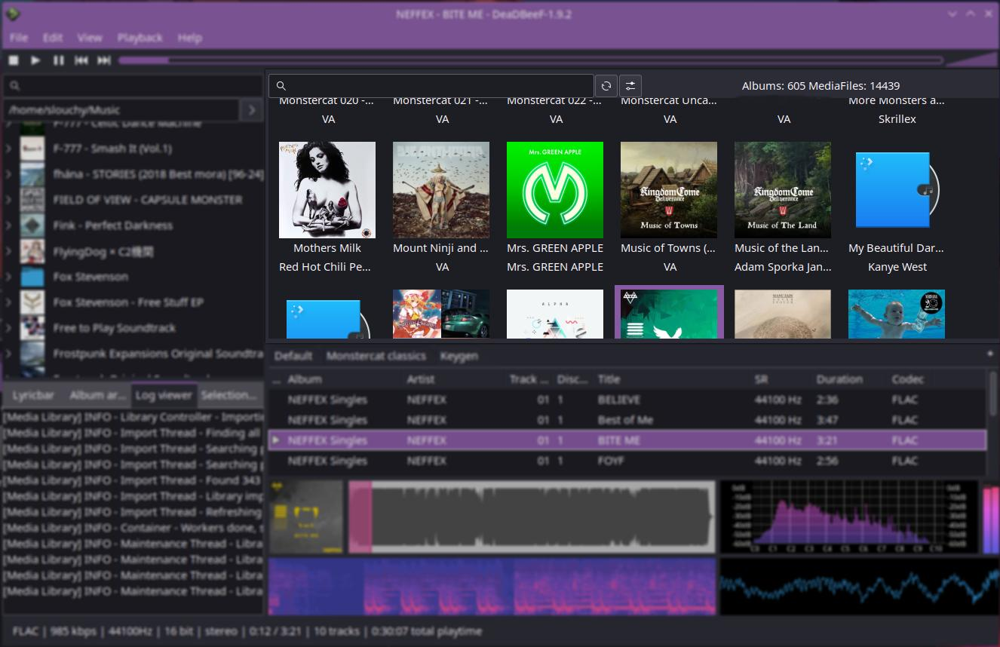

*This plugin is in **very** early development stage. There may be dragons inside. Please check **Current stage***

# Deadbeef Media Library



Media library is currently missing in Deadbeef, so people wanting to use Deadbeef were left with two options:

- Use abandoned and outdated file browser plugin, that was very unstable
- Tediously create playlists for your musical needs

First option was fixed by creating [Filebrowser Reborn](https://github.com/duzda/deadbeef-filebrowser-reborn) which aims at being similar to original, while also fixing everything that was wrong with it.
Second option might work for some, but is really not an option at all for others, because of the tedious process.

This plugin is based on the Filebrowser Reborn plugin, which has sparked the idea of creating this. Both plugins are currently in development and are developed together with some shared code-base. 
Media library exists because sometimes you want to browse your albums, group by artists and so on. *I personally use both plugins side by side.* There also might be a situation where your songs are not divided into sane folder structure, making the Filebrowser less user-friendly to use.

## Current stage

Currently works:

- Fetch all media files in a folder
- Load metadata from each file
- Show icon view containing all the albums with cover art
- Double click the album to load the album tracks into currently selected playlist
- Saves the loaded metadata, files and cover arts into cache for quicker startup next time
- Custom config dialog that would be more versatile for showing loaded files and doing imports

Planned features:

- Select metadata for grouping into icon view (show artists instead of albums for example)
- Select which metadata should be shown in icon view together with the picture
- Context menu containing quality of life tools (like showing dialog with songs in album, metadata etc.) (Partially)
- *See issues on github for more planned features and discussion*

Keep in mind that this plugin is very early in development.

## Instalation

Binaries are located on [Releases](https://github.com/SlouchyButton/deadbeef-media-library/releases) page. You can put them into``` ~/.local/lib/deadbeef/ ```. This will allow you to create new widget.

## Compilation

On Arch Linux:

``` pacman -S --needed boost-libs gtkmm3 ninja meson gcc taglib ```

### Meson+Ninja

Compile the project:

``` meson build && cd build && ninja ```

Binaries will be located in ./build/src/ folder.

After compilation, you can use ``` quick-install.sh ``` to quickly move the file to correct location.

To uninstall the plugin, you can remove the .so file from ``` ~/.local/lib/deadbeef/ ``` or run ``` quick-remove.sh ```.

### Makefile

If you prefer Makefile for compilation, it is now possible to use that.

``` make ``` will build the project into ./buildMake folder.

``` make install ``` will install the plugin

``` make buildinstall ``` will build and install the plugin

``` make buildinstallrun ``` will build, install plugin and run deadbeef in one command. This is ease of life target for debugging and developing.

``` make uninstall ``` will uninstall the plugin

``` make clean ``` will delete buildMake folder

*Note: This project uses **boost modules: serialization, filesystem and system**. Default path to this library is set to /usr/lib in Makefile. This is the default on Arch Linux, but this can differ on your environment and since Makefile is dumb and can't find the library itself like meson, neither does boost library support the pkg-config you have to find the boost libraries yourself on your system, if the compilation fails.*

## Contribution

Before making contributions, please create issue where the topic can be discussed. This will prevent tedious remakes of code that you would like to merge.
*This doesn't necessarily apply to small bug fixes or tweaks.*
